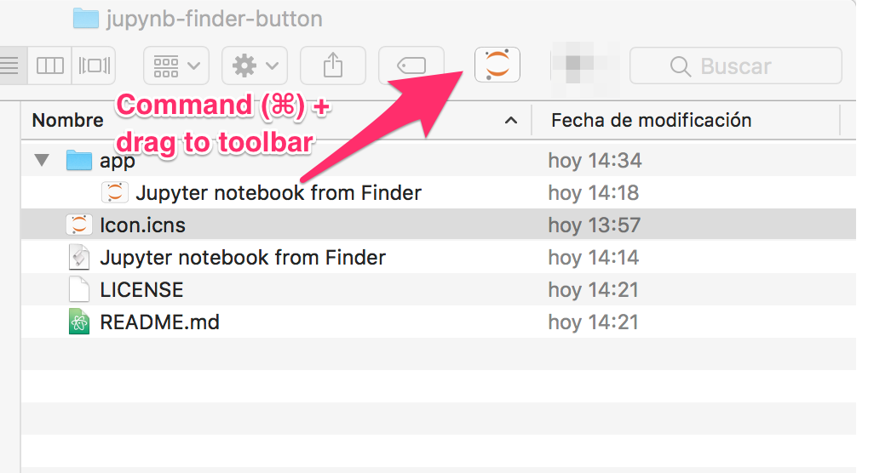

# Launch Jupyter notebook from macOS Finder

A macOS app for running a Jupyter notebook instance directly from Finder's current folder.

**Important:** It is meant to be installed as a Finder toolbar button.

## Installation and usage

1. Download and unzip the [latest release of the app](https://github.com/lmarti/jupynb-finder-button/releases/latest).
2. Press the command (⌘) key and drag app to the Finder toolbar:



3. A Jupyter notebook instance will be launched on the current folder when you click the toolbar button.

## From source

1. Clone `jupynb-finder-button` repository:
```bash
git clone https://github.com/lmarti/jupynb-finder-button
```

2. Follow Dimitrios Zacharopoulos
 [instructions]( https://www.youtube.com/watch?v=IGejtUXYGpA) on how to convert an AppleScript script into a macOS app.

3. A ICNS image button for the app is available.

Enjoy!
